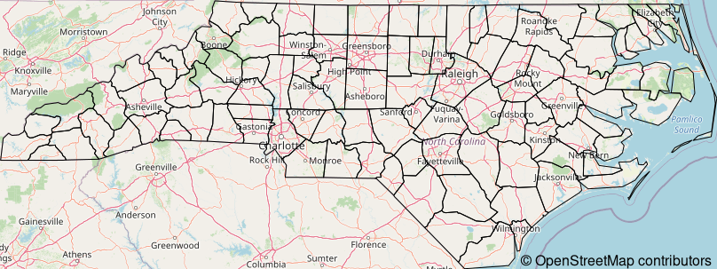
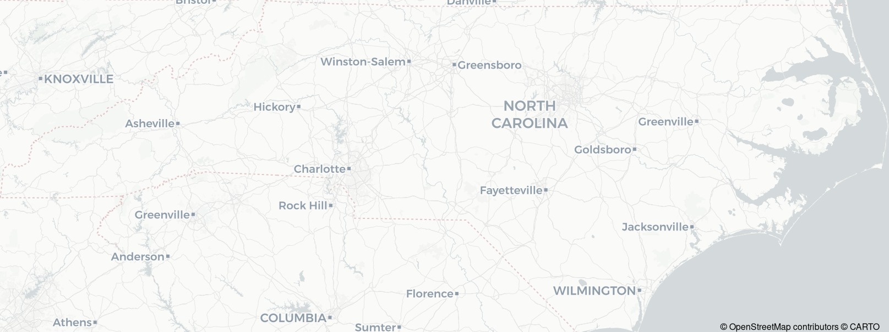
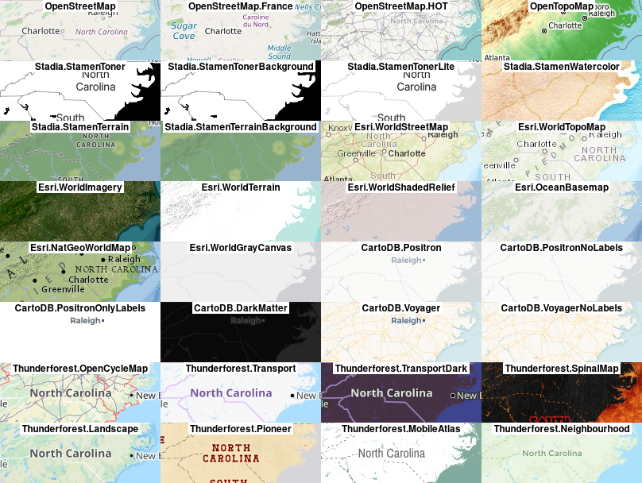

<!-- README.md is generated from README.Rmd. Please edit that file -->

# maptiles 

<!-- badges: start -->

[](https://github.com/riatelab/maptiles/actions/workflows/check-standard.yaml)
[](https://app.codecov.io/gh/riatelab/maptiles?branch=main)
[](https://CRAN.R-project.org/package=maptiles)
 [](https://www.repostatus.org/#active)
<!-- badges: end -->

To create maps from tiles, `maptiles` downloads, composes and displays
tiles from a large number of providers (e.g. OpenStreetMap, Stadia,
Esri, CARTO, or Thunderforest).

## Installation

You can install the released version of `maptiles` from
[CRAN](https://CRAN.R-project.org/package=maptiles) with:

``` r
install.packages("maptiles")
```

You can install the development version of `maptiles` from GitHub with:

``` r
# install.packages("remotes")
remotes::install_github("riatelab/maptiles")
```

## Demo

This is a basic example which shows you how to dowload and display
OpenStreetMap tiles over North Carolina:

``` r
library(sf)
#> Linking to GEOS 3.11.1, GDAL 3.6.2, PROJ 9.1.1; sf_use_s2() is TRUE
library(maptiles)
# import North Carolina counties
nc_raw <- st_read(system.file("shape/nc.shp", package = "sf"), quiet = TRUE)
# Project to EPSG:3857
nc <- st_transform(nc_raw, "EPSG:3857")
# dowload tiles and compose raster (SpatRaster)
nc_osm <- get_tiles(nc, crop = TRUE)
# display map
plot_tiles(nc_osm)
# add Norh Carolina counties
plot(st_geometry(nc), col = NA, add = TRUE)
# add credit
mtext(text = get_credit("OpenStreetMap"), side = 1, line = -1, adj = .99)
```



`maptiles` gives access to a lot of tiles servers, but it is possible to
add others. The following example demonstrates the setting of a map
tiles server and how to cache the original tiles for future use:

``` r
# define the tile server parameters
osmpos <- create_provider(
  name = "CARTO.POSITRON",
  url = "https://{s}.basemaps.cartocdn.com/light_all/{z}/{x}/{y}.png",
  sub = c("a", "b", "c", "d"),
  citation = "© OpenStreetMap contributors © CARTO "
)
# dowload tiles and compose raster (SpatRaster)
nc_osmpos <- get_tiles(
  x = nc, provider = osmpos, crop = TRUE,
  cachedir = tempdir(), verbose = TRUE
)
#> Zoom: 7
#> Source(s): © OpenStreetMap contributors © CARTO 
#> Cache directory: /tmp/RtmpQKpnO9/CARTO.POSITRON
#> 8 tiles
# display map
plot_tiles(nc_osmpos)
# display credits
mtext(text = get_credit(osmpos), side = 1, line = -1, adj = .99)
```



The following figure shows mini maps for most of the tiles providers
available:



## Projection

Original tiles use a projection known as “Web Mercator”, “WGS84 / Pseudo
Mercator”, “Google Mercator”, “EPSG:3857” or “EPSG:900913”. In most
cases `get_tiles()` uses the projection of its `x` argument to reproject
the tiles. If you wish to avoid any deformation induced by the
reprojection process, use “EPSG:3857” for `x` projection.

## Attribution of map tiles

All maps available through `maptiles` are offered freely by various
providers. The only counterpart from the user is to properly display an
attribution text on the maps. `get_credit()` displays a short
attribution text to add on each map using the downloaded tiles.

## Alternatives

There are many alternative packages that pursue the same objective as
`maptiles`. Some focus on a specific map tiles provider (e.g. Mapbox,
Google, OpenStreetMap) or on a specific graphics device (`ggplot2`). The
goal of `maptiles` is to be flexible enough to allow the use of
different providers and to have a minimal number of robust and modern
dependencies. However, depending on the use case, one of following
packages may better suit your needs:

- [`ceramic`](https://github.com/hypertidy/ceramic)  
- [`ggmap`](https://github.com/dkahle/ggmap) (`ggplot2` focused)
- [`ggspatial`](https://github.com/paleolimbot/ggspatial) (`ggplot2`
  focused, based on `rosm`)
- [`mapboxapi`](https://github.com/walkerke/mapboxapi) (mapbox)
- [`mapsapi`](https://github.com/michaeldorman/mapsapi/) (google, based
  on `RgoogleMaps`)
- [`OpenStreetMap`](https://github.com/ifellows/ROSM) (requires Java)
- [`RgoogleMaps`](https://github.com/markusloecher/rgooglemaps) (google)
- [`rosm`](https://github.com/paleolimbot/rosm)
- …

## Note

Not to be confused with
[`tilemaps`](https://github.com/kaerosen/tilemaps), that “implements an
algorithm for generating maps, known as tile maps, in which each region
is represented by a single tile of the same shape and size.”
